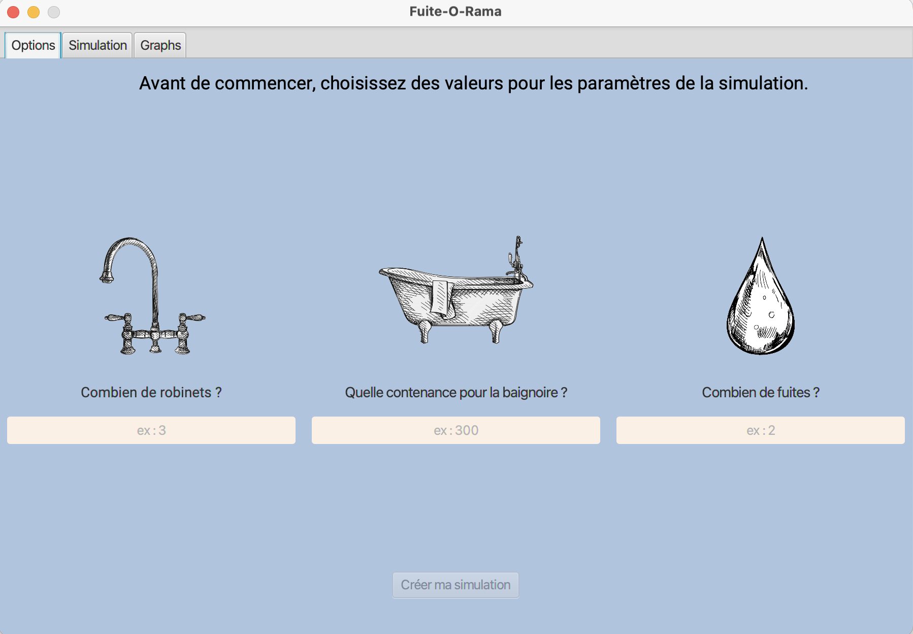
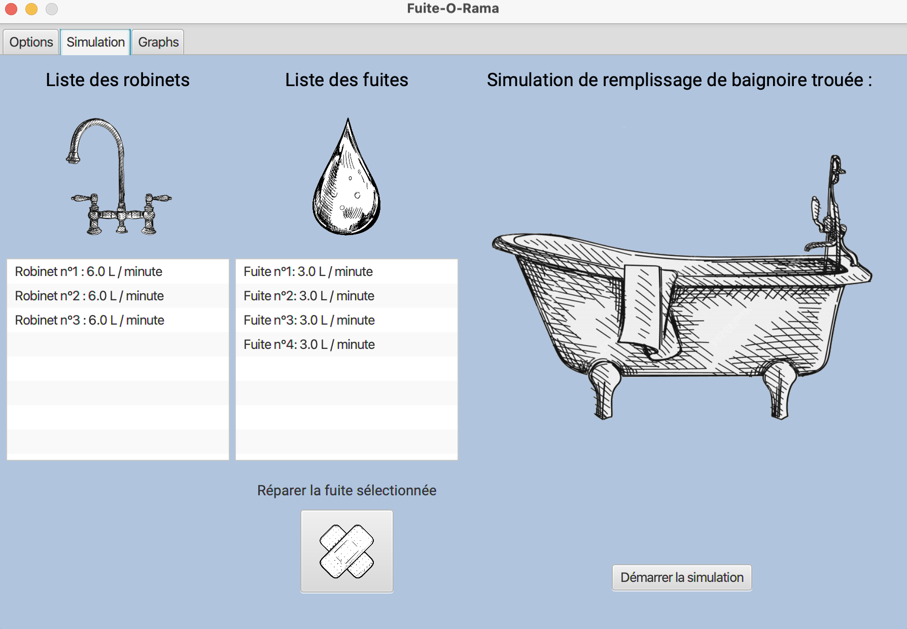
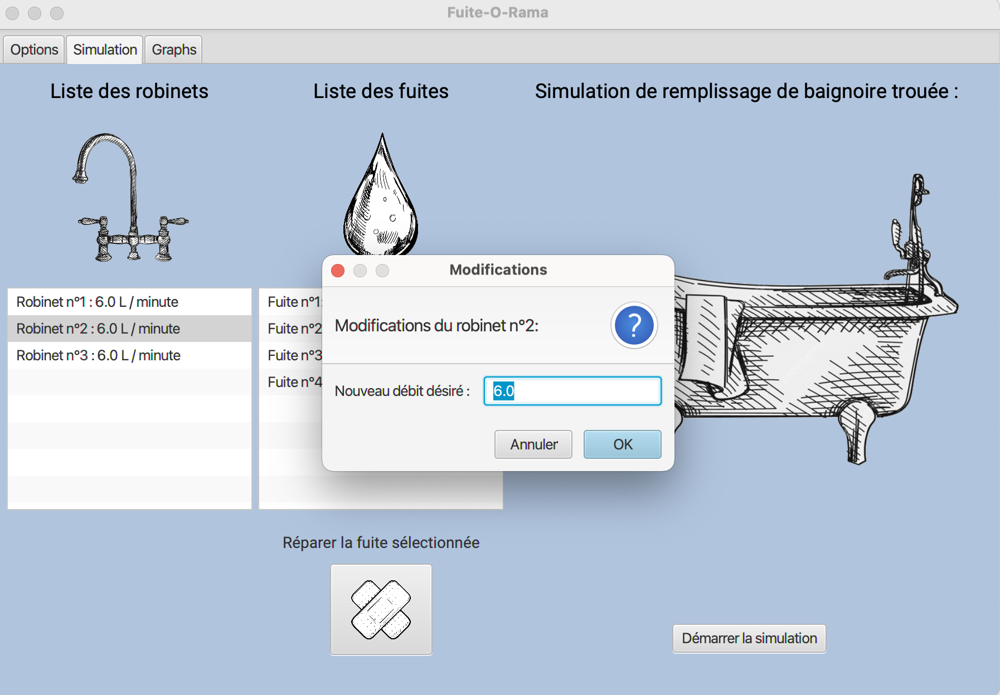
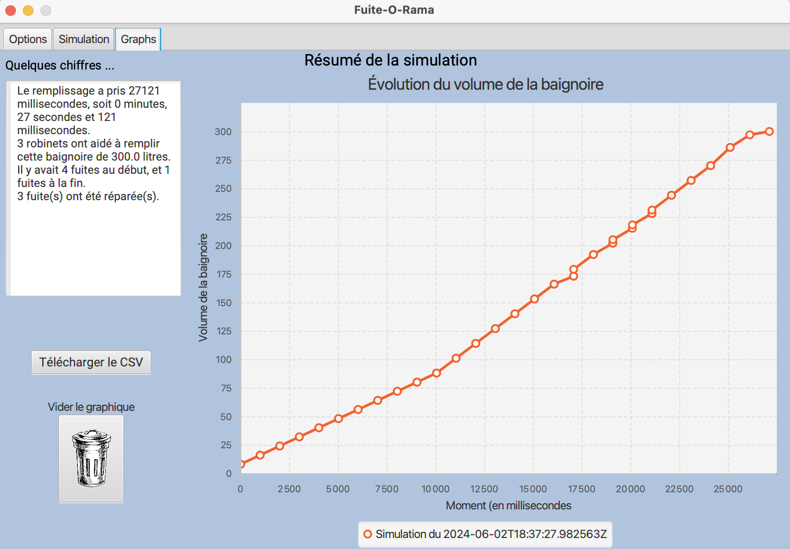

# Petit guide pour une première utilisation de Fuite-O-Rama

Afin de vous accompagner dans votre première utilisation de Fuite-O-Rama, nous vous proposons ce guide.

## Étape 1 : Configuration Initiale

### Renseigner les Informations de Base

Pour commencer, veuillez renseigner les informations suivantes :

1. **Nombre de Robinets** : Indiquez le nombre de robinets disponibles.
2. **Nombre de Fuites** : Indiquez le nombre de fuites présentes.

Ces informations sont obligatoires pour démarrer l'application.

### Capacité de la Baignoire (Optionnel)

Vous pouvez également renseigner la capacité de la baignoire si vous le souhaitez, bien que cette information soit optionnelle.

Une fois ces informations saisies, l'application basculera automatiquement vers l'onglet **Simulation**.

## Étape 2 : Configuration des Débits

Dans cet onglet, vous pouvez effectuer les configurations suivantes avant de démarrer la simulation :

1. **Modifier le Débit des Fuites** : Si vous souhaitez modifier le débit des fuites, faites-le à ce stade. Il ne sera plus possible de le changer après. Pour cela, cliquez sur une fuite pour ajuster son débit.
2. **Modifier le Débit des Robinets** : Cliquez sur un robinet pour ajuster son débit.

### Démarrer la Simulation

Une fois les débits configurés, cliquez sur **Démarrer la simulation** pour lancer la simulation. Vous verrez la baignoire se remplir devant vos yeux.

## Étape 3 : Interagir avec la Simulation

Pendant la simulation, vous pouvez effectuer les actions suivantes :

1. **Réparer une Fuite** : Si vous souhaitez réparer une fuite, cliquez sur la fuite que vous souhaitez réparer puis sur le bouton pansement.

Une fois la simulation terminée, l'application basculera automatiquement vers l'onglet suivant.

## Étape 4 : Visualisation des résultats de la simulation

### Courbe de Simulation

Une courbe représentant la courbe de remplissage de la baignoire sera générée dès que la simulation sera terminé. 
Vous trouverez également des informations intéressantes sur la simulation à gauche de l'écran, comme le temps qu'il a fallu pour
remplir la baignoire, le nombre de robinets ou encore le nombre de fuites réparées lors de la simulation.
Sur l'axe X, vous voyez le temps écoulé depuis le début de la simulation, et sur l'axe Y le volume de la baignoire à un instant précis.

### Générer un CSV

Si vous souhaitez obtenir un fichier CSV des résultats, cliquez sur le bouton **Télécharger le CSV**. Notez que ce fichier sera perdu si vous relancez une simulation. Le CSV sera disponible dans le dossier source du projet.

### Gestion des Courbes

- **Conservation des Courbes** : La courbe sera conservée et si vous effectuez plusieurs simulations, plusieurs courbes seront disponibles.
- **Nettoyer les Courbes** : Pour nettoyer les courbes, cliquez sur le bouton poubelle.

## Étape 5 : Relancer une Simulation

- Pour relancer une simulation avec les mêmes paramètres, retournez à l'onglet **Simulation** et cliquez sur **Démarrer la simulation**.
- Pour modifier les paramètres, retournez à l'onglet **Options** et recommencez toute la procédure.

## Quitter l'Application

Pour quitter l'application, cliquez sur la croix rouge.

Nous espérons que ce guide vous aidera à utiliser Fuite-O-Rama de manière agréable.
